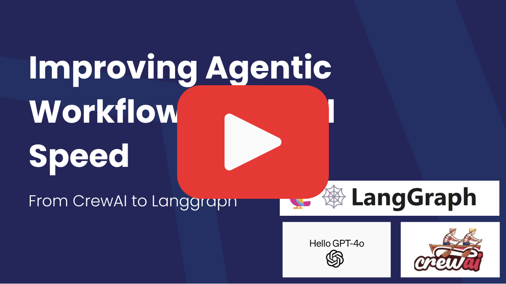
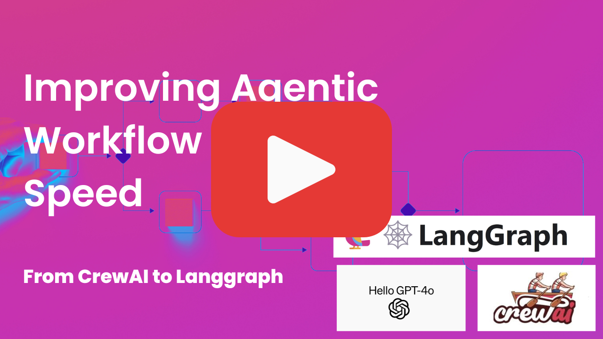

# Repo Upgrade

This project demonstrates a unique approach for you to adopt Multi-agents to solve automation tasks. We'll start with blackbox, autonomous multi-agents with CrewAI to autotomate Python repo dependencies upgrade, then explore different methods to optimise the cost and performance using different architecture including Langgraph.  

## Videos

### Part 1: CrewAI
[](https://youtu.be/hvcd8Xjpd7A)

### Part 2: Langgraph
[](https://youtu.be/_k82vx4qaLo)

## Introduction
To create a robust automation pipeline, we rarely achieve that with single try. If you are a subject matter expert, my recommendation is to start with Workflow and add LLM into the loop to address specific edge cases which takes lots of time to engineer.  

Another approach if you have a vague idea is to started with autonomous agents. With this scenario, we let the agents do exploration, then instrument what they do to extract the optimal workflow. Finally, use a different architecture to capture that workflow to optimise cost and performance.  

This repo provide you an example on how to use second approach. We will create multi-agents workflow to automate dependencies upgrade in python project as follow:  
- Check dependency changelog and get relevant information
- Analyse change to create backlog stories
- Based on story, attempt to upgrade dependencies
- If autonomous upgrade fail, assign developer to work on it

## Installation

To get started, follow these steps:

1. Clone the repository:
```sh
git clone https://github.com/AgiFlow/repo-upgrade
cd repo-upgrade
```

2. Install dependencies:
```sh
poetry install
```

This repo use playwright to craw web page. If you haven't install it, use below commands:  

``` sh
pip install pytest-playwright
playwright install
```

3. Configure environment:
```sh
cp .env.example .env
```

To connect with AGIFlow, set `AGIFLOW_API_KEY` with the api_key acquired from control plane via our development server, or sign-up with [AGIFLow's controlplane](https://app.agiflow.io) and get the keys..  
NOTE: You can run AGIFlow development via our open source repository

``` sh
git clone https://github.com/AgiFlow/agiflow-sdks
cd agiflow-sdks
cd dockers/dev
docker-compose up
```
With docker-compose setup, set additional environment variable  `AGIFLOW_BASE_URL=https://localhost:3000/api/dataplane`.

## Usage

We want to observe and run automation in sequence to see the difference.

1. CrewAI (hierarchical)
CrewAI hierarchical process is more autonomous, with Product Manager agent plan and delegate tasks to Developer Agent.  

```sh
poetry run crewai-hierarchical
```

2. CrewAI (sequential)
CrewAI sequential is more predictable, we want Agent to complete its task and pass result to the next agent liked Manufactoring process.  

```sh
poetry run crewai-sequential
```

3. Langgraph
We remove ReAct prompt from agent to make the output more predictable; aiming for 6-llm calls only.  

```sh
poetry run langgraph
```

4. Langgraph Optimised
Optimise prompt context by removing intermediate messages from one agent to another.  

```sh
poetry run langgraph_ops
```

## License

This project is licensed under the MIT License. See the [LICENSE](LICENSE) file for more details.
